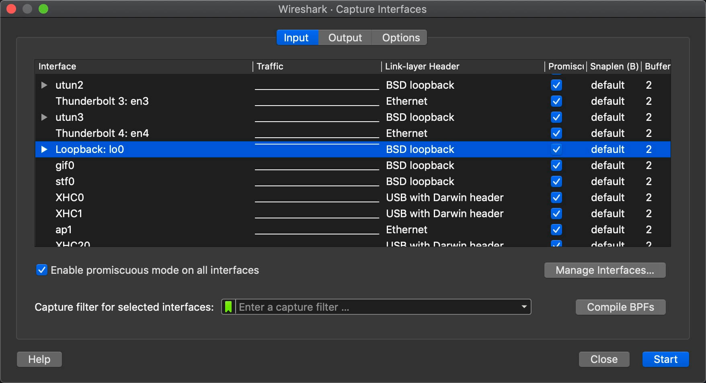
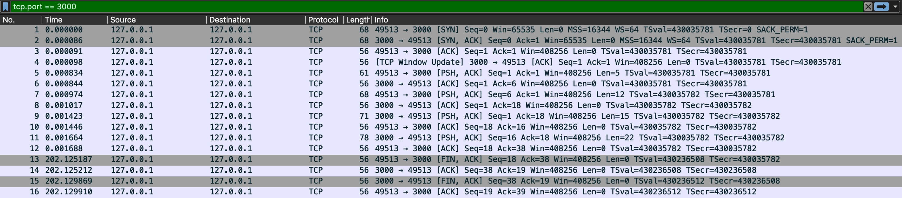

# node-tcp-demo

A demo for learning tcp protocol using net module.

## Quick Start

### Server

```bash
$ yarn server
# Server is started at 127.0.0.1:3000
```

### Client

```bash
$ yarn client
# [Server] Received: Hello
# [Server] Received: I am client.
```

## Captcure TCP Packets

1. Open Wireshark & using loopback interface



2. Apply a display filter `tcp.port == 3000`



Or you can import specified packets: [download](./data/wireshark.pcap)